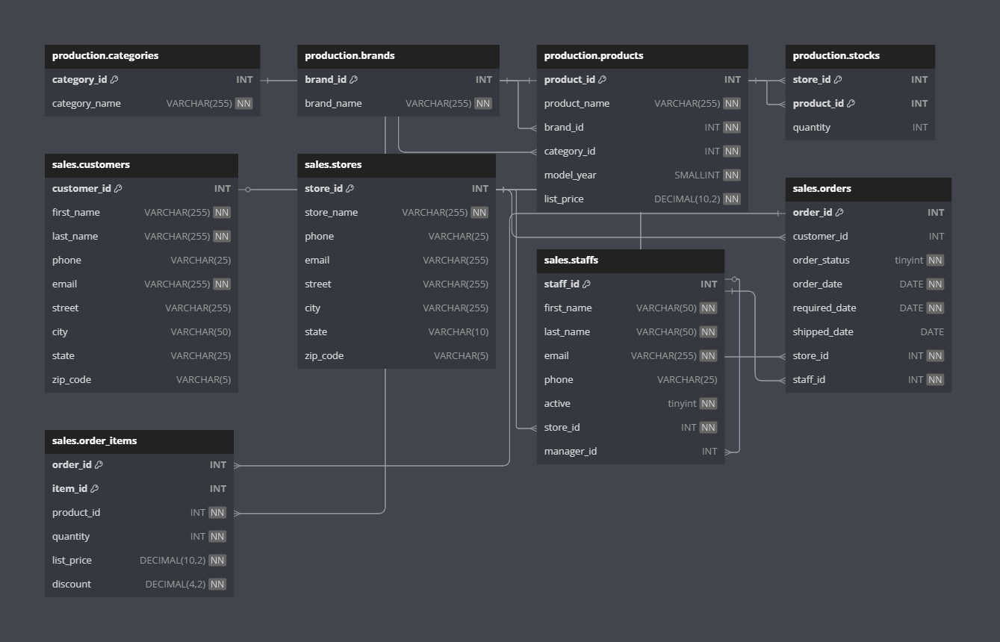

<!-- Styles -->
<style>
  .center {
    display: flex;
    justify-content: center;
    align-items: center;
  }
</style>

# 🚲 Bike Store Analysis
 Project of an analysis of a Bike Store to practice SQL, Excel and Tableau.

For this project we are going to use SQL Server for the database. Then we are going to connect our dataset to Excel and we are going to create an interactive Dashboard. And finally we are going to connect our Excel dataset to Tableau and also we are going to create a Dashboard.

# 📚 Data

In our data we have the following tables: 

## Production

* brands
  * brand_id
  * brand_name

* categories
  * category_id
  * category_name

* products
  * product_id
  * product_name
  * brand_id
  * category_id
  * model_year
  * list_price

* stocks
  * store_id
  * product_id
  * quantity

## Sales

* customers
  * customer_id
  * first_name
  * last_name
  * phone
  * email
  * street
  * city
  * state
  * zip_code

* order_items
  * order_id
  * item_id
  * product_id
  * quantity
  * list_price
  * discount

* orders
  * order_id
  * customer_id
  * order_status
  * order_date
  * required_date
  * shipped_date
  * store_id
  * staff_id

* staffs
  * staff_id
  * first_name
  * last_name
  * email
  * phone
  * active
  * store_id
  * manager_id

* stores
  * store_id
  * store_name
  * phone
  * email
  * street
  * city
  * state
  * zip_code

<div class=center>

</div>
# SQL 

In this section we need to understand what are the necessities of the business.

They want to know:
* The state of the sales activities within the company and gain insight into the various trance happening in the sales volume over the period 2016 to 2018.

* The revenue per region, store, product category and brand. 

* A list of the top customers and sales representatives.

With this in mind, let's take a look at the data and create a query to get all the information that we need to solve this problem.

Let's start with the period of time, we will obtain this information in the orders table:

```sql
SELECT 
  MIN(order_date) AS "Min Date", 
  MAX(order_date) AS "Max Date" 
FROM 
  sales.orders;
```

This query give us the following result:

<div class=center>


|   |  Min Date  | Max Date  |
|---|------------|-----------|
| 1 | 2016-01-01 | 2018-12-28|

</div>

So information that we have correspond to the period of time of our analysis.

For the data that we need to collect is: 

* order id
* order date
* customer name
* sales representative name
* region
* store
* product 
* brand
* quantity
* price
* discount

Let's begin with the order id, customer name and order date

```sql
SELECT
  ord.order_id,
  CONCAT(cust.first_name,' ',cust.last_name) as "Customer Name",
  cust.city,
  cust.state,
  ord.order_date
FROM
  sales.orders ord
  LEFT JOIN sales.customers cust ON cust.customer_id= ord.customer_id;
```
<div class=center>

</div>

Now let's summarize the quantity of products and the revenue.

```sql
SELECT
  ord.order_id,
  CONCAT(cust.first_name,' ',cust.last_name) AS "customer_name",
  cust.city,
  cust.state,
  ord.order_date,
  SUM(items.quantity) AS "total_units",
  SUM(items.quantity * items.list_price) AS "revenue"
 FROM
  sales.orders ord
  LEFT JOIN sales.customers cust ON cust.customer_id= ord.customer_id
  LEFT JOIN sales.order_items items ON items.order_id = ord.order_id
GROUP BY
  ord.order_id,
  CONCAT(cust.first_name,' ',cust.last_name),
  cust.city,
  cust.state,
  ord.order_date;
```

<div>

</div>


Now let's add the product.

```sql
SELECT
  ord.order_id,
  CONCAT(cust.first_name,' ',cust.last_name) AS "customer_name",
  cust.city,
  cust.state,
  ord.order_date,
  SUM(items.quantity) AS "total_units",
  SUM(items.quantity * items.list_price) AS "revenue",
  prod.product_name
 FROM
  sales.orders ord
  LEFT JOIN sales.customers cust ON cust.customer_id= ord.customer_id
  LEFT JOIN sales.order_items items ON items.order_id = ord.order_id
  LEFT JOIN production.products prod ON prod.product_id = items.product_id
GROUP BY
  ord.order_id,
  CONCAT(cust.first_name,' ',cust.last_name),
  cust.city,
  cust.state,
  ord.order_date,
  prod.product_name;
```

<div class=center>

</div>

Now let's add the category

```sql
SELECT
  ord.order_id,
  CONCAT(cust.first_name,' ',cust.last_name) AS "customer_name",
  cust.city,
  cust.state,
  ord.order_date,
  SUM(items.quantity) AS "total_units",
  SUM(items.quantity * items.list_price) AS "revenue",
  prod.product_name,
  cat.category_name
 FROM
  sales.orders ord
  LEFT JOIN sales.customers cust ON cust.customer_id= ord.customer_id
  LEFT JOIN sales.order_items items ON items.order_id = ord.order_id
  LEFT JOIN production.products prod ON prod.product_id = items.product_id
  LEFT JOIN production.categories cat ON cat.category_id = prod.category_id
GROUP BY
  ord.order_id,
  CONCAT(cust.first_name,' ',cust.last_name),
  cust.city,
  cust.state,
  ord.order_date,
  prod.product_name,
  cat.category_name
```

<div class=center>

</div>
Next the brand name

```sql
SELECT
  ord.order_id,
  CONCAT(cust.first_name,' ',cust.last_name) AS "customer_name",
  cust.city,
  cust.state,
  ord.order_date,
  SUM(items.quantity) AS "total_units",
  SUM(items.quantity * items.list_price) AS "revenue",
  prod.product_name,
  cat.category_name,
  brand.brand_name
 FROM
  sales.orders ord
  LEFT JOIN sales.customers cust ON cust.customer_id= ord.customer_id
  LEFT JOIN sales.order_items items ON items.order_id = ord.order_id
  LEFT JOIN production.products prod ON prod.product_id = items.product_id
  LEFT JOIN production.categories cat ON cat.category_id = prod.category_id
  LEFT JOIN production.brands brand ON brand.brand_id = prod.brand_id
GROUP BY
  ord.order_id,
  CONCAT(cust.first_name,' ',cust.last_name),
  cust.city,
  cust.state,
  ord.order_date,
  prod.product_name,
  cat.category_name,
  brand.brand_name
```

<div class=center>

</div>

And now the store name

```sql
SELECT
  ord.order_id,
  CONCAT(cust.first_name,' ',cust.last_name) AS "customer_name",
  cust.city,
  cust.state,
  ord.order_date,
  SUM(items.quantity) AS "total_units",
  SUM(items.quantity * items.list_price) AS "revenue",
  prod.product_name,
  cat.category_name,
  brand.brand_name,
  store.store_name
 FROM
  sales.orders ord
  LEFT JOIN sales.customers cust ON cust.customer_id= ord.customer_id
  LEFT JOIN sales.order_items items ON items.order_id = ord.order_id
  LEFT JOIN production.products prod ON prod.product_id = items.product_id
  LEFT JOIN production.categories cat ON cat.category_id = prod.category_id
  LEFT JOIN production.brands brand ON brand.brand_id = prod.brand_id
  LEFT JOIN sales.stores store ON store.store_id = ord.store_id
GROUP BY
  ord.order_id,
  CONCAT(cust.first_name,' ',cust.last_name),
  cust.city,
  cust.state,
  ord.order_date,
  prod.product_name,
  cat.category_name,
  brand.brand_name,
  store.store_name
```

<div class=center>

</div>

Finally let's add the sales rep

```sql
SELECT
  ord.order_id,
  CONCAT(cust.first_name,' ',cust.last_name) AS "customer_name",
  cust.city,
  cust.state,
  ord.order_date,
  SUM(items.quantity) AS "total_units",
  SUM(items.quantity * items.list_price) AS "revenue",
  prod.product_name,
  cat.category_name,
  brand.brand_name,
  store.store_name,
  CONCAT(staff.first_name,' ',staff.last_name) AS "staff_name"
 FROM
  sales.orders ord
  LEFT JOIN sales.customers cust ON cust.customer_id= ord.customer_id
  LEFT JOIN sales.order_items items ON items.order_id = ord.order_id
  LEFT JOIN production.products prod ON prod.product_id = items.product_id
  LEFT JOIN production.categories cat ON cat.category_id = prod.category_id
  LEFT JOIN production.brands brand ON brand.brand_id = prod.brand_id
  LEFT JOIN sales.stores store ON store.store_id = ord.store_id
  LEFT JOIN sales.staffs staff ON staff.staff_id = ord.staff_id
GROUP BY
  ord.order_id,
  CONCAT(cust.first_name,' ',cust.last_name),
  cust.city,
  cust.state,
  ord.order_date,
  prod.product_name,
  cat.category_name,
  brand.brand_name,
  store.store_name,
  CONCAT(staff.first_name,' ',staff.last_name)
```

<div class=center>
  
</div>

Now we already have our dataset prepared.